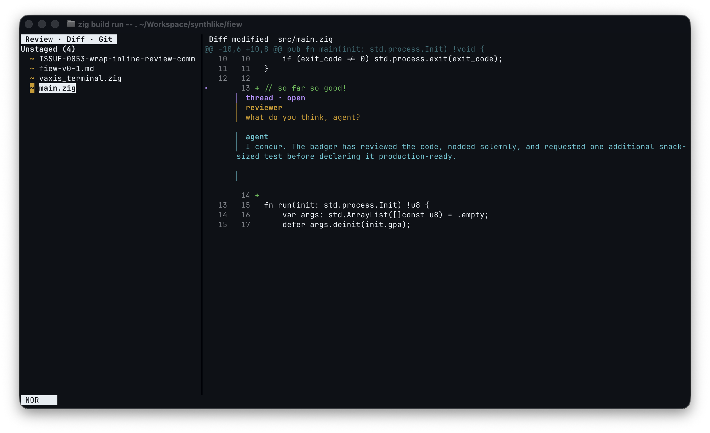
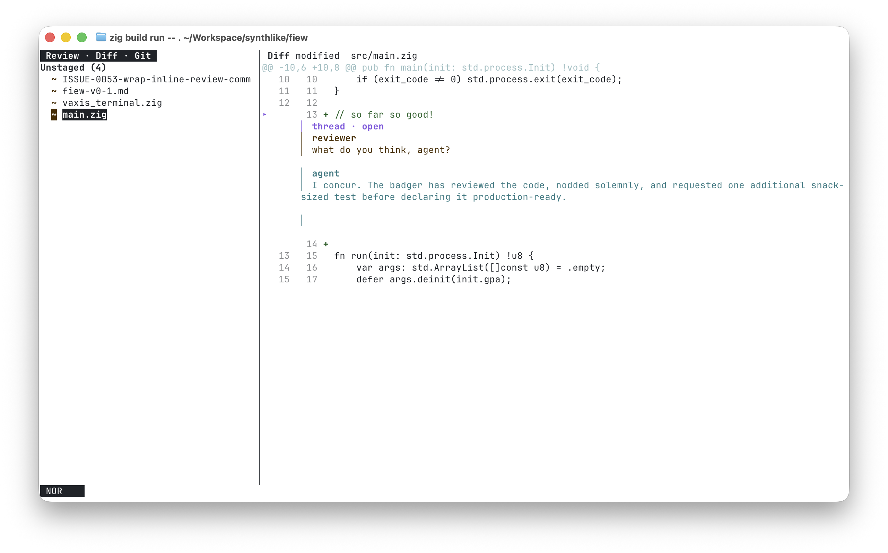
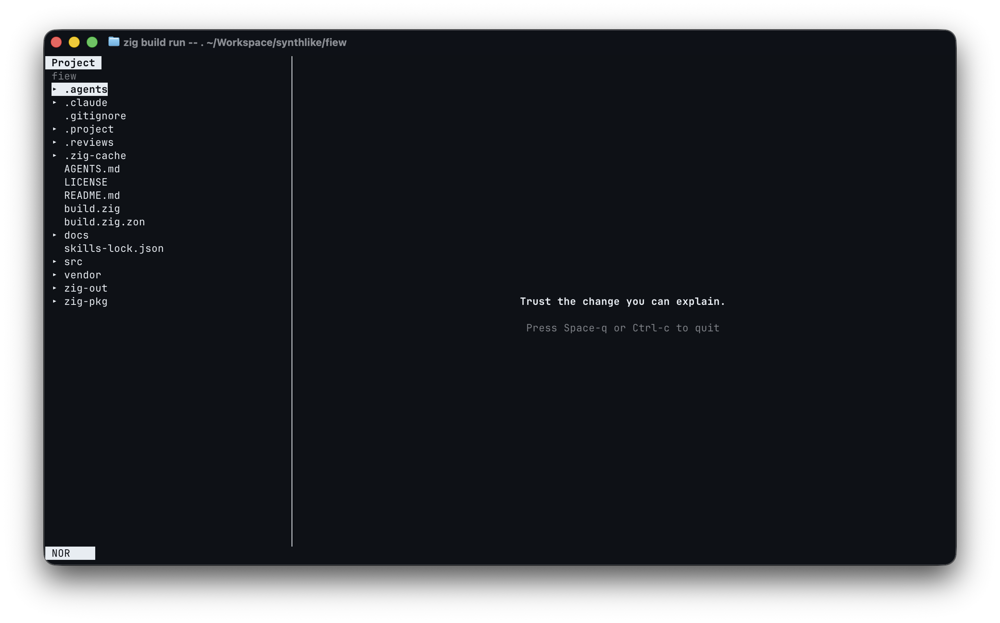
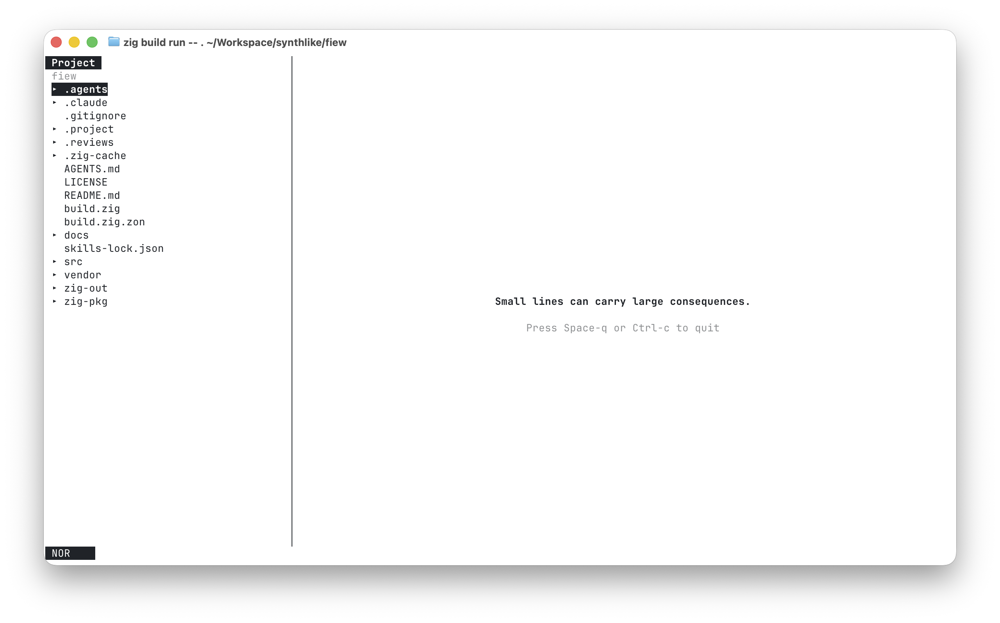

# fiew

**fiew improves the human-in-the-loop process when working with AI agents.**

It is a read-first terminal workspace for reviewing current Git changes.
The reviewer inspects a diff, leaves comments, asks an agent to respond,
and approves only after every concern is explicitly resolved.

## The workflow

An agent can make a large, plausible-looking change quickly. fiew gives the
reviewer a compact place to slow down, inspect the actual diff, and retain
questions that need answers.

1. Open the repository in fiew.
2. Open **Review · Diff · Git** and inspect Staged, Unstaged, and Untracked
   changes.
3. Create a thread on a changed line/range or on a whole file.
4. Ask an agent to read the review and append replies through the non-interactive
   review CLI.
5. Use **Review · Threads** to revisit, resolve, or delete complete threads.
6. Approve only when every thread is current and explicitly resolved.

fiew also supports bookmarks for source locations you need to revisit while
reviewing. Zig files receive Tree-sitter-powered syntax highlighting, code
folding, and basic structural navigation; other files remain plain text.

## Screenshots

**Review Diff** lets you focus on the actual change, with its anchored
discussion and agent replies alongside it.

<p>
  
  
</p>

**Project** provides the read-only repository context around the change, so you
can inspect related source between review passes.

<p>
  
  
</p>

## Install v0.1

fiew v0.1 is an unsigned, unnotarized Apple Silicon macOS binary for Ghostty.
Git must be installed for Review Diff; non-Git directories remain browsable.

Download and verify the GitHub Release archive:

```sh
version=0.1.0
curl -fLO "https://github.com/synthlike/fiew/releases/download/v${version}/fiew-v${version}-darwin-arm64.tar.gz"
curl -fLO "https://github.com/synthlike/fiew/releases/download/v${version}/fiew-v${version}-darwin-arm64.tar.gz.sha256"
shasum -a 256 -c "fiew-v${version}-darwin-arm64.tar.gz.sha256"
tar -xzf "fiew-v${version}-darwin-arm64.tar.gz"
install -d "$HOME/.local/bin"
install -m 755 fiew "$HOME/.local/bin/fiew"
```

Ensure `$HOME/.local/bin` is on `PATH`, then inspect and run it:

```sh
fiew --version
fiew /path/to/repository
```

If macOS blocks the unsigned executable, verify its checksum before deciding
whether to approve it in **System Settings · Privacy & Security**. v0.1 does not
provide signing, notarization, a package-manager formula, or automatic updates.

### Build from source

Install Zig 0.16.0, fetch the locked dependencies, and run fiew in Ghostty:

```sh
zig build --fetch
zig build run -- /path/to/repository
```

Start the review workflow inside fiew:

```text
Space r d    open Review · Diff · Git
Space r t    open Review · Threads
```

In Review Diff, select a changed line or a one-side range and press `Space r n`
to create a thread. Use `Space r f` to comment on a whole changed file.

In Review Threads, select a thread and use:

```text
Space r a    append a reviewer comment
Space r r    resolve or reopen the thread
Space r x    delete the complete thread (with confirmation)
Enter        return to the thread's current diff anchor
```

## Agent handoff

The reviewer owns the review lifecycle. An agent receives a narrow, explicit
interface for discovering the current review, reading its public history, and
adding a reply:

```sh
# Create a reviewer-owned local review interactively.
fiew review start

# An agent can inspect the current review.
fiew review show

# It can add a reply to an existing thread, but cannot create, resolve,
# reopen, delete, or change the current review.
fiew review reply <thread-id> --body-file response.md
```

Review state is canonical private repository-local `fiew.review/v1` JSON in
`.reviews/`. `fiew review show` exposes public JSON or Markdown projections;
agents never need direct canonical-file access. fiew keeps one explicit
current-review pointer per repository, so routine `show` and `reply` commands do
not need to guess which review is active.

Bookmarks are canonical private repository-local `fiew.bookmark/v1` JSON in
`.bookmarks/bookmarks.json` and never appear in agent review output. Ensure both
`.reviews/` and `.bookmarks/` are ignored using your repository's preferred Git
configuration. fiew does not inspect or modify `.gitignore` or Git metadata.

### Install the agent cooperation skill

The optional `fiew` Agent Skill teaches compatible coding agents to suggest a
review after a completed repository change and to respond when you explicitly
hand back a completed review. The `fiew` executable must already be installed
and available on the agent's `PATH`.

Install the skill for the current project:

```sh
npx skills add synthlike/fiew --skill fiew
```

Or install it globally for your user:

```sh
npx skills add synthlike/fiew --skill fiew --global
```

After reviewing, tell the agent **“Review done”**. It will use `fiew review
show` and `fiew review reply` to address Open or Outdated threads while leaving
thread resolution and approval to you. Skill activation is best-effort and
depends on the agent; the portable Agent Skills format cannot guarantee a
post-change hook on every supported agent. The skill never launches fiew or
blocks task completion while waiting for a review.

## Everyday navigation

| Key | Action |
| --- | --- |
| `Space r d` | Open or resume Review Diff |
| `Space r d r` | Refresh the current Diff snapshot |
| `Space r t` | Open Review Threads |
| `Space p` | Open Project |
| `Space f a` | Find any repository file by path |
| `Space f g` | Find tracked and non-ignored untracked Git files |
| `Space b` | Open Bookmarks |
| `] f` / `[ f` | Next / previous changed file |
| `] h` / `[ h` | Next / previous hunk |
| `] c` / `[ c` | Next / previous changed line |
| `Enter` | Pin a preview or open source from a diff line |
| `Ctrl-o` / `Ctrl-i` | Back / forward through locations |
| `Space ?` | Generated key help |
| `:quit` or `Space q` | Quit |

The status line shows the current mode (`NOR`, `EXT`, or `CMD`) and active
leader path, such as `LDR r d`.

### Trust ZLS for Zig definitions

Install ZLS 0.16.x and ensure `zls` is available on `PATH`. Because ZLS may
evaluate repository-controlled Zig build logic, fiew requires explicit trust
for each repository before launching it.

1. Open the repository in fiew.
2. Press `:` and enter `zls-trust-repository`.
3. Select **Trust repository for ZLS** and press `Enter`.
4. Open a UTF-8 Zig file and press `g d` to go to the selected definition.

Trust is persisted for the canonical repository identity. Use the named
commands `zls-status`, `zls-restart`, or `zls-revoke-trust` to inspect, restart,
or revoke the integration.

## What v0.1 supports

- Apple Silicon macOS in Ghostty;
- immutable repository browsing with location history;
- current Git review of Staged, Unstaged, and Untracked changes, including
  textual unified diffs and explicit metadata for unsupported textual forms;
- reviewer-owned file and line/range threads with agent replies, explicit
  resolution, and constrained exact-context re-anchoring after Git refreshes;
- private repository-local bookmarks for reviewer navigation; and
- Tree-sitter-powered Zig syntax highlighting, folding, and basic structural
  navigation (Zig is the only structural language in v0.1); and
- keyboard and mouse navigation with a selection-first modal interaction model.

## Development

```sh
zig build
zig build test
zig fmt --check src build.zig
zig build -Dtarget=x86_64-linux-musl -Dcpu=baseline
zig build -Dtarget=aarch64-linux-musl -Dcpu=baseline
```

`zig build test` is deterministic and does not need a network connection or an
installed Git executable. Git integration tests are opt-in:

```sh
zig build test -Dgit-integration
```

Release maintainers can produce the deterministic v0.1 archive and checksum:

```sh
python3 tools/package-release.py --version 0.1.0
```

See the [v0.1 release checklist](docs/engineering/v0.1-release-checklist.md).

## Project documentation

- [v0.1 specification](docs/specs/fiew-v0-1.md)
- [engineering baseline](docs/engineering/fiew-v0-1-engineering-baseline.md)
- [architecture decisions](docs/decisions/)

## License

MIT. See [LICENSE](LICENSE).
